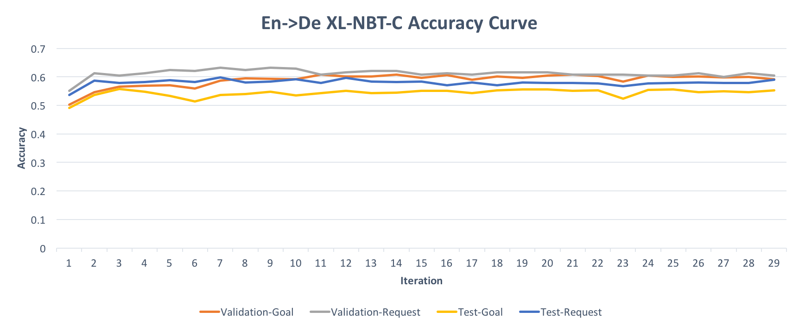
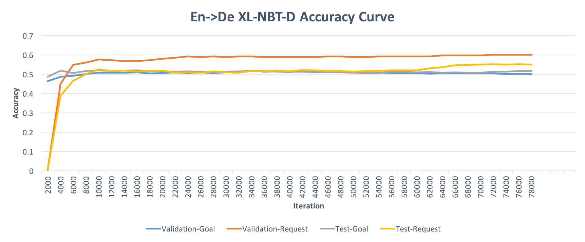

# Cross-Lingual-NBT
Code for EMNLP 2018 paper "XL-NBT: A Cross-lingual Neural Belief Tracking Framework"

In this paper, we propose the interesting cross-lingual state tracking problem and design a simple yet very efficient algorithm to tackle it. This repository contains all the experiment codes for both En->De and En->It transfer scenarios under two different parallel resource cases.

For more details, please check the latest version of the paper: ???


## Prerequisites
1. Python 2.7
2. TensorFlow 1.4
3. cuda & cudnn


## Code Structure
1. **code/** contains all the python modules to support the algorithm
2. **config/** contains all the parameter setting
3. **data/** contains the dialog data for different languages and also the parallel translation data for XL-NBT-C
4. **word-vectors/** contains the pre-trained multi-lingual word embedding and two bilingual dictionary for XL-NBT-D
5. **models/** stores the saved models during training
6. **train.sh** sets up all the supervised learning and transfer learning

## Config File


```
[train]
batch_size=256
batches_per_epoch=64
max_iteration=100000
restore=True
alpha=1.0

[model]
id=student-dict-bilingual
restore_id=teacher-bilingual
dataset_name=woz
language=english
foreign_language=german
value_specific_decoder=False
learn_belief_state_update=True
tau=0.1
```

## Learning Curve

<p align="XL-NBT-C">

</p>


<p align="XL-NBT-D">

</p>


## Usage
### 1. Setup

Clone this github repository recursively:
```
git clone https://github.com/wenhuchen/Cross-Lingual-NBT.git ./
```
Please Download the [Bilingual embedding](https://drive.google.com/drive/folders/1gwXnZtDPDmnIWu9mryktWBojE9JvT4mg?usp=sharing) and put them into **word-vectors/** folder

### 2. Supervised Learning
We use cross entropy loss to train the teacher model, please set "id=teacher-bilingual" and "restore=False" in the config file.

```
./train.sh train
```
Here, we already upload the pre-trained teacher models into the **models/** folder, you can skip this step and jump to step 3 or 4 depending on differnt transfer scenarios.

### 3. Transfer Learning XL-NBT-C
We use teacher-student framework to transfer knowledge across language boundary, please set "restore_id=teacher-bilingual" and "restore=True" in the config file, and "id=student-corpus-bilingual".

```
./train.sh corpus_transfer
```

### 4. Transfer Learning XL-NBT-D
We use teacher-student framework to transfer knowledge across language boundary, please set "restore_id=teacher-bilingual" and "restore=True" in the config file, and "id=student-dict-bilingual".

```
./train.sh dict_transfer
```

## If you find this code useful, please cite the paper

```
???
```

## Acknowledgement

[Neural-Belief Tracker](https://github.com/nmrksic/neural-belief-tracker)

